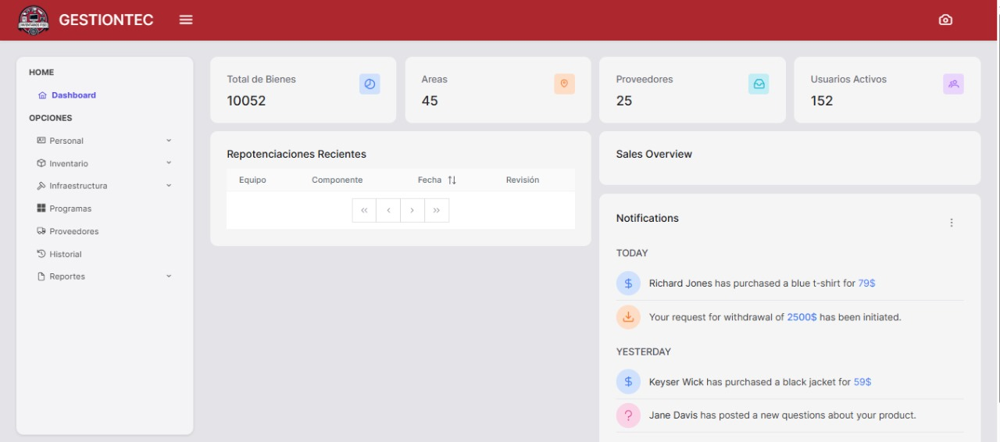
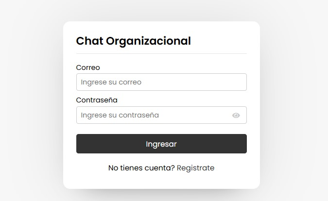
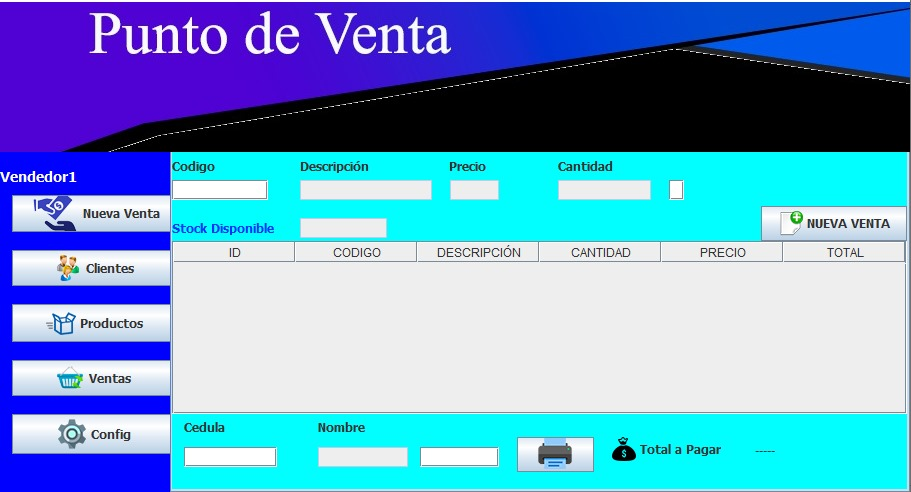

  

<h1 align="center">Hi 👋, Soy Angel Caiza</h1>

  

<!-- Start Sobre mí -->
<h2>🙋‍♂️ Sobre mí</h2>

  

  <strong>-Soy un apasionado desarrollador Full Stack</strong> con habilidades tanto en Frontend como Backend. 
  -Me encanta crear soluciones eficientes y visuales utilizando tecnologías como 
  <strong>React.js, Angular,
    Node.js y PHP</strong>. 
  -Siempre estoy en busca de nuevos desafíos que me ayuden a crecer profesional y personalmente.

<blockquote>
  🚀 <strong>“Si lo puedes imaginar, lo puedes programar.”</strong> – Alejandro Taboada (Programación ATS)
</blockquote>

*Desarrollador / Programador*

<ul>
  <li>🎓 Graduado como Ingeniero en Desarrollo de Software en la Universidad Técnica de Ambato.</li>
  <li>🔥 Apasionado por el código limpio y las buenas prácticas.</li>
  <li>🌱 Aprendiendo algo nuevo cada día.</li>
  <li>💪 Contribuyendo al código abierto.</li>
</ul>
<!-- End Sobre mí -->

<!--Profile Count Badge-->

  

##  🌐 Social 

  

  

## 🛠️  Habilidades
<picture>
  <source media="(prefers-color-scheme: dark)" srcset="./Skills_Animation_Dark.gif">
  <source media="(prefers-color-scheme: light)" srcset="./Skills_Animation_White.gif">
  
</picture>
 
<h3 align="left">FronEnd</h3>
 <ul align="left">
  <li>Angular</li>
  <li>React</li>
</ul>
<h3 align="left">BackEnd</h3>
 <ul align="left">
  <li>Node.js</li>
  <li>Php</li>
  <li>JavaScript</li>
</ul>
<h3 align="left">Bases de Datos</h3>
 <ul align="left">
  <li>Mysql</li>
  <li>Posgrest</li>
  <li>SQL Server</li>
  <li>firebase</li>
</ul>
 
 
 
 
<!-- Proyectos Destacados -->
<h2>🚧 Mis Proyectos mas destacados</h2>

<table>
<tr>
  <td width="50%">
  <h3 align="center">Gestión de Inventarios</h3>
  

    
    

      
    

    
<strong>Gestión de Inventario </strong>  es un sistema de gestión de inventarios desarrollado para la Universidad Técnica de Ambato.

  
                
</td>
  
  <td width="50%">
  <h3 align="center">Chat Organizacional</h3>
  

    
    

      
    

    
<strong>Chat Organizacional  </strong> es un sistema de chat organizacional diseñado para facilitar la comunicación interna entre los miembros de una empresa o equipo.

  
                
</td>

  </td>
  <tr>
  <td width="50%">
  <h3 align="center">Gestiión de Ventas</h3>
  

    
    

      
    

    
<strong>Gestión de Ventas  </strong>  es un sistema de ventas con interfaz gráfica en Java Swing, desarrollado en NetBeans.

  
                
</td>
   <td width="50%">
  <h3 align="center">Simulador Banco</h3>
  

    
    

      
    

    
<strong>Simulador Banco </strong>es un simulador bancario desarrollado para calcular y visualizar tablas de amortización.

  
                
</td>
</table>  
<!-- Estadísticas -->
<!-- Estadísticas -->
<h2>📊 Estadísticas de GitHub</h2>

<table>
  <tr>
    <td>
      
    </td>
    <td>
      
    </td>
  </tr>
  <tr>
    <td colspan="2" align="center">
      
    </td>
  </tr>
</table>

